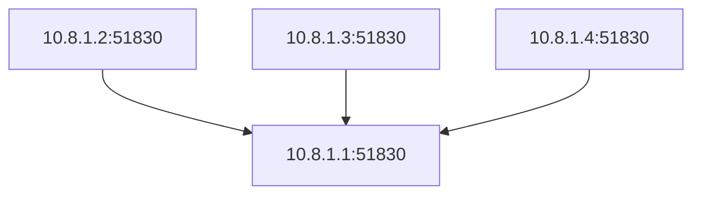
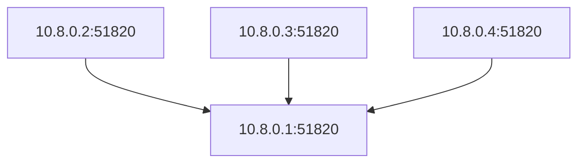

# WireGuard VPN PoC
This is a simple PoC for setting up a WireGuard VPN server and client. WireGuard is a modern VPN protocol that is faster, simpler, and more secure than traditional VPN protocols like OpenVPN and IPsec.

## Architecture
Server is running on a public IP address and the peers are running on private IP addresses. The server acts as a gateway for the peers to communicate with each other. The server assigns a unique IP address to each peer and routes the traffic between the peers.

### 1. Basic [WireGuard](https://www.wireguard.com/) Setup
In our case, the server is running locally on the machine and the peers are running on different machines. They communicate with each other using the WireGuard protocol (UDP port 51830).

### 2. [WireGuard Easy](https://github.com/wg-easy/wg-easy) Setup
WireGuard Easy is a simple and easy-to-use WireGuard VPN server and client setup. It provides a web interface to manage the WireGuard configuration and allows you to add, remove, and edit peers easily.


## Key Pair Generation
Since WireGuard uses public/private key pairs for authentication, you need to generate a pair of keys for the server and each client. The private key should be kept secret and should not be shared with anyone. The public key can be shared with anyone.

### 1. generate client key pair
```bash
wg genkey | tee client_private.key | wg pubkey > client_public.key
```

### 2. generate server key pair
```bash
wg genkey | tee server_private.key | wg pubkey > server_public.key
```
### 3. generate preshared key (optional)
Preshared keys are used to authenticate the server and client. It is optional but recommended for additional security.
```bash
wg genpsk | tee preshared.key
```

## WG Server
### 1. config for server (```/etc/wireguard/wg0.conf``` in server machine)
```bash
# Server
[Interface]
PrivateKey = +LoS4rKh1KvTvK+imYoAnEjjS5vAa9ujurE/b/9pnE0=       # server's private key
Address = 10.8.1.1/24                                           # server's IP address
ListenPort = 51830                                              # default port is 51820
PreUp = 
PostUp =  iptables -t nat -A POSTROUTING -s 10.8.1.0/24 -o eth0 -j MASQUERADE; iptables -A INPUT -p udp -m udp --dport 51820 -j ACCEPT; iptables -A FORWARD -i wg0 -j ACCEPT; iptables -A FORWARD -o wg0 -j ACCEPT; 
PreDown = 
PostDown =  iptables -t nat -D POSTROUTING -s 10.1.0.0/24 -o eth0 -j MASQUERADE; iptables -D INPUT -p udp -m udp --dport 51820 -j ACCEPT; iptables -D FORWARD -i wg0 -j ACCEPT; iptables -D FORWARD -o wg0 -j ACCEPT; 
```
Note: Replace the PrivateKey and Address with the server's private key and IP address.
### 2. config for peer (```/etc/wireguard/wg0.conf``` in server machine)
```bash
# Client: wg0 (91f6f4a6-09ee-47d0-a569-1bb85673f167)
[Peer]
PublicKey = dR4KpOGGCAG7/9DTDzIXYZXN5IJKJVbB7plfmEvf/FE=        # client's public key
PresharedKey = Z7Kn07cSKHedWUv7VMHdNxX0yX1+ULbcl9ovzMVYc60=     # preshared key (optional)
AllowedIPs = 10.8.1.2/32                                        # client's IP address (must be unique)

# Client: wg1 (067704e6-8fdb-4539-90b6-27b4d60fb678)
[Peer]
PublicKey = vI1Xx+pMEuvNOe7MYSB3LkcCVw7l64eYyCST2+OL/Sk=
PresharedKey = GWHsW/CEW1idzc5rJSyTXJ7EP9Pml8muYBarZ6iuDM0=
AllowedIPs = 10.8.1.3/32

# Client: wg2 (ac07ff4b-47b0-44d9-8bdd-c7a12e557b5b)
[Peer]
PublicKey = ltcz/Cl8TCmlMNvh02ne698OVpGMLyMyZlQSYiqhj30=
PresharedKey = WHJR/bb60Y/fym6f2qV2jdBbbc8nl6uHcmGqrsbz0gY=
AllowedIPs = 10.8.1.4/32
```
Note: Replace the PublicKey, PresharedKey, and AllowedIPs with the client's public key, preshared key, and IP address.

### 3. start the wg server
```bash
wg-quick up wg0

# Output should be like this:
# [#] 
# [#] ip link add wg0 type wireguard
# [#] wg setconf wg0 /dev/fd/63
# [#] ip -4 address add 10.8.1.1/24 dev wg0
# [#] ip link set mtu 1420 up dev wg0
# [#] iptables -t nat -A POSTROUTING -s 10.8.1.0/24 -o eth0 -j MASQUERADE; iptables -A INPUT -p udp -m udp --dport 51820 -j ACCEPT; iptables -A FORWARD -i wg0 -j ACCEPT; iptables -A FORWARD -o wg0 -j ACCEPT;
```

### 4. Verify the WireGuard server is running
#### 4.1. Check the status
```bash
sudo wg show

# Output should be like this:
# interface: wg0
#   public key: td2y2HOUProuNqUMZGU6E26+tff+EkYH0sym2YQytAg=
#   private key: (hidden)
#   listening port: 51830

# peer: dR4KpOGGCAG7/9DTDzIXYZXN5IJKJVbB7plfmEvf/FE=
#   preshared key: (hidden)
#   allowed ips: 10.8.1.2/32

# peer: vI1Xx+pMEuvNOe7MYSB3LkcCVw7l64eYyCST2+OL/Sk=
#   preshared key: (hidden)
#   allowed ips: 10.8.1.3/32

# peer: ltcz/Cl8TCmlMNvh02ne698OVpGMLyMyZlQSYiqhj30=
#   preshared key: (hidden)
#   allowed ips: 10.8.1.4/32
```
#### 4.2. Check the network interface
```bash
ip a show wg0

# Output should be like this:
# 4: wg0: <POINTOPOINT,NOARP,UP,LOWER_UP> mtu 1420 qdisc noqueue state UNKNOWN group default qlen 1000
#     link/none 
#     inet 10.8.1.1/24 scope global wg0
#        valid_lft forever preferred_lft forever
```

## WG Client
### 1. config for client (```/etc/wireguard/wg1.conf``` in client machine)
```shell
# /etc/wireguard/wg1.conf in client machine
[Interface]
PrivateKey = mHgsNG46q2brAWrIkBUsb38z/9Ia0eE4aWPdW4DQvlk=       # client's private key
Address = 10.8.1.2/24
DNS = 1.1.1.1

[Peer]
PublicKey = td2y2HOUProuNqUMZGU6E26+tff+EkYH0sym2YQytAg=        # server's public key
PresharedKey = Z7Kn07cSKHedWUv7VMHdNxX0yX1+ULbcl9ovzMVYc60=     # preshared key (optional)
AllowedIPs = 0.0.0.0/0, ::/0
PersistentKeepalive = 0
Endpoint = 192.168.3.253:51830
```
Note: Replace the PublicKey, PresharedKey, and Endpoint with the server's public key, preshared key, and IP address.

### 2. Start the wg client
```shell
wg-quick up wg1

# Output should be like this:
# [#] ip link add wg11 type wireguard
# [#] wg setconf wg11 /dev/fd/63
# [#] ip -4 address add 10.8.1.2/24 dev wg11
# [#] ip link set mtu 1420 up dev wg11
# [#] resolvconf -a wg11 -m 0 -x
# [#] wg set wg11 fwmark 51821
# [#] ip -6 rule add not fwmark 51821 table 51821
# [#] ip -6 rule add table main suppress_prefixlength 0
# [#] ip -6 route add ::/0 dev wg11 table 51821
# [#] nft -f /dev/fd/63
# [#] ip -4 rule add not fwmark 51821 table 51821
# [#] ip -4 rule add table main suppress_prefixlength 0
# [#] ip -4 route add 0.0.0.0/0 dev wg11 table 51821
# [#] sysctl -q net.ipv4.conf.all.src_valid_mark=1
# [#] nft -f /dev/fd/63
```
### 3. Verify the connection
```shell
wg show

# Output should be like this:
# interface: wg1
#   public key: vI1Xx+pMEuvNOe7MYSB3LkcCVw7l64eYyCST2+OL/Sk=
#   private key: (hidden)
#   listening port: 55566
#   fwmark: 0xca6c

# peer: td2y2HOUProuNqUMZGU6E26+tff+EkYH0sym2YQytAg=
#   preshared key: (hidden)
#   endpoint: 192.168.3.253:51820
#   allowed ips: 0.0.0.0/0, ::/0
#   latest handshake: 18 minutes, 25 seconds ago
#   transfer: 1.54 MiB received, 140.51 KiB sent
```

## Testing
### 1. Ping the server from the client
```shell
# From client(10.8.1.2)
ping 10.8.1.1
```
### 2. Ping the client from the server
```shell
# From server(10.8.1.1)
ping 10.8.1.2
```
### 3. Ping the peer from other peers
```shell
# From client(10.8.1.2)
ping 10.8.1.3
```
### 4. Check the public IP address
```shell
curl ifconfig.me
```

## Environment Setup
### start docker compose services
```shell
docker-compose up -d
```

## Clean Up
### stop the wg server
```shell
# run this command in the server machine(10.8.1.1)
wg-quick down wg0
```
### stop the wg client
```shell
# run this command in the client machine(10.8.1.2)
wg-quick down wg1
```

## Troubleshooting
### manually remove the linking layer
```bash
# remove the wireguard interface if it is not removed by wg-quick down
ip link delete wg0
```
### manually remove the iptables rules
```bash
iptables -t nat -D POSTROUTING -s
iptables -D INPUT -p udp -m udp --dport 51820 -j ACCEPT
iptables -D FORWARD -i wg0 -j ACCEPT
iptables -D FORWARD -o wg0 -j ACCEPT
```
### manually remove the wireguard peer
```bash
wg set wg0 peer <public_key> remove
```
### check the iptables rules
```bash
iptables -L
```
### check the wireguard interface
```bash
ip a show wg0
```

## References
1. [WireGuard](https://www.wireguard.com/)
2. [WireGuard Quick Start](https://www.wireguard.com/quickstart/)
3. [WireGuard Installation](https://www.wireguard.com/install/)
4. [WireGuard Easy](https://github.com/wg-easy/wg-easy)

